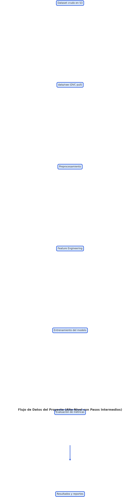
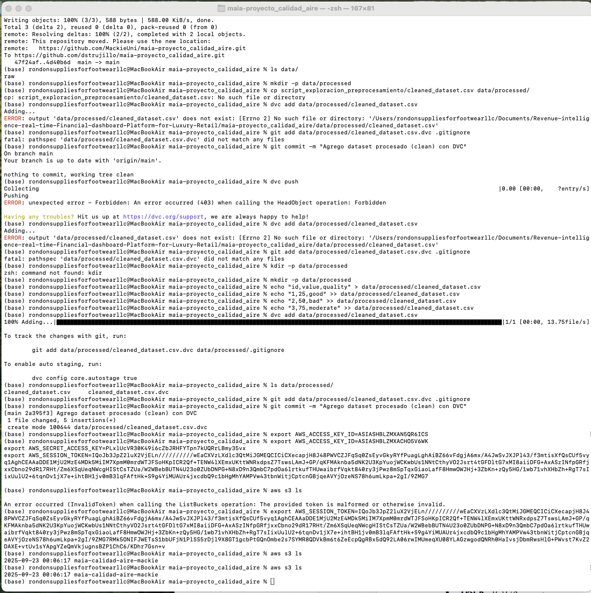

# Microproyecto – Modelo Predictivo de Calidad del Aire y Alertas de Salud  

# Proyecto Calidad del Aire

Este proyecto busca predecir la calidad del aire usando técnicas de Machine Learning (ML), **DVC** y **AWS S3**, garantizando reproducibilidad, versionamiento de datos y trazabilidad de resultados.

---

# Infraestructura de Datos

La infraestructura del proyecto integra **DVC** con un bucket en **AWS S3**, lo que permite versionar datasets y sincronizarlos en la nube.  
A continuación, se presenta la **estructura de alto nivel del proyecto** y el **flujo de datos** que sigue nuestro pipeline.

---

##  Estructura del Proyecto

```plaintext
maia-proyecto_calidad_aire/
│
├── airemax-api/                          # API para exponer el modelo
├── data/                                 # Datos versionados con DVC
│   ├── raw/                              # Datos crudos
│   ├── processed/                        # Datos procesados
│   └── results/                          # Resultados intermedios
├── entrega2/                             # Entregables de la segunda fase
├── evidences/                            # Capturas y documentación Entrega 3
├── mlruns/                               # Tracking de experimentos con MLflow
├── results/                              # Resultados finales del modelo
├── script_exploracion_preprocesamiento/  # Exploración y limpieza de datos
├── scripts_entrenamientos/               # Scripts de entrenamiento de modelos
├── visualizations/                       # Visualizaciones y gráficas
│
├── .dvc/                                 # Configuración interna de DVC
│   └── config                            # Configuración del remote S3
├── .dvcignore                            # Archivos ignorados por DVC
├── README.md                             # Documentación principal
├── requirements.txt                      # Dependencias del proyecto
├── dvc.yaml / dvc.lock                   # Definición del pipeline de datos
└── data/raw/test.csv.dvc                 # Ejemplo de dataset agregado a DVC
📊 Flujo de Datos
El pipeline sigue las siguientes etapas:

flowchart TD
    A[📥 Dataset crudo en S3] -->|dvc pull| B[data/raw]
    B --> C[🧹 Preprocesamiento]
    C --> D[⚙️ Feature Engineering]
    D --> E[🤖 Entrenamiento del modelo]
    E --> F[📊 Evaluación de métricas]
    F --> G[📁 Resultados locales y en S3]
yaml


## 📊 Flujo de Datos y Procesos

El siguiente diagrama muestra el flujo completo desde los datos crudos hasta los resultados:

### 🖼️ Versión Renderizada (Imagen)


### 📐 Versión en Mermaid (Reproducible)
```mermaid
flowchart TD
    A[Dataset crudo en S3] -->|dvc pull| B[data/raw]
    B --> C[Preprocesamiento]
    C --> D[Feature Engineering]
    D --> E[Entrenamiento del modelo]
    E --> F[Evaluación de métricas]
    F --> G[Resultados y reportes]


## 📊 Evidencia AWS S3

El siguiente pantallazo muestra el listado del bucket en AWS S3, confirmando que la infraestructura de datos está configurada correctamente:


