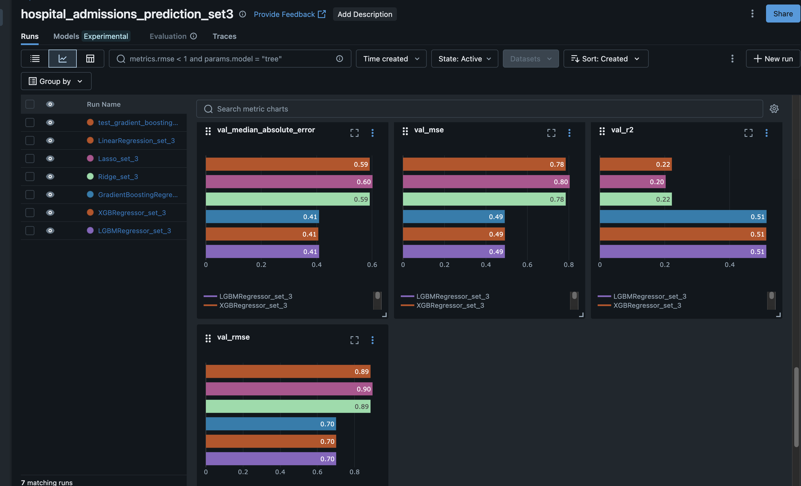
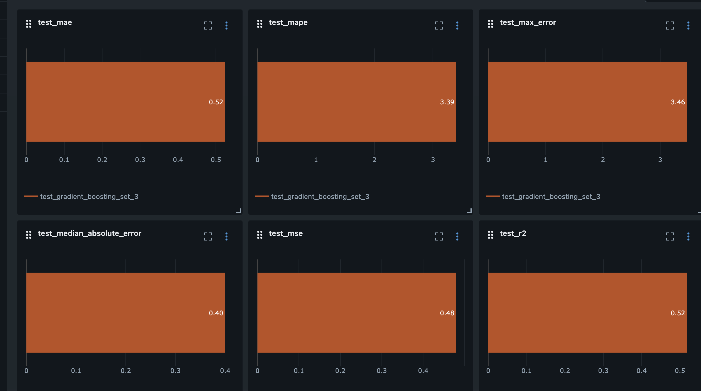

# Pipeline de Entrenamiento de Modelos para Predicción de Hospital Admissions

## Descripción General

Este pipeline implementa un sistema completo de entrenamiento y evaluación de modelos de machine learning para predecir admisiones hospitalarias basadas en datos de calidad del aire. El sistema está diseñado con modularidad, seguimiento de experimentos y capacidad de reproducción.

## Arquitectura del Pipeline

### 1. Configuración del Experimento (`experiment_config.py`)

El sistema utiliza un enfoque basado en configuración que permite:

- **Selección de conjuntos de características**: Actualmente usando el feature set 3
- **Modelos a entrenar**: Linear Regression, Ridge, Lasso, Gradient Boosting, XGBoost, LightGBM
- **División de datos**: 60% train, 20% validation, 20% test
- **Método de búsqueda**: Grid Search con 3-fold cross validation
- **Seguimiento con MLflow**: Para registro de experimentos

### 2. Utilidades de Modelos (`model_utils.py`)

Proporciona funciones esenciales para:

- Carga y preparación de datos
- División y escalado de datasets
- Configuración de modelos y hiperparámetros
- Entrenamiento con búsqueda de hiperparámetros
- Cálculo de métricas y logging en MLflow

### 3. Script Principal de Entrenamiento (`train_models.py`)

Orquesta el proceso completo:
- Configuración de MLflow
- Carga y preparación de datos
- Entrenamiento de modelos en orden de prioridad
- Evaluación final en conjunto de test
- Almacenamiento de resultados y modelos

## Resultados del Entrenamiento

### Métricas de Rendimiento por Modelo

| Modelo | Train RMSE | Train R² | Val RMSE | Val R² | Tiempo Entrenamiento |
|--------|------------|----------|----------|---------|---------------------|
| LightGBM | 0.7005 | 0.5088 | 0.7011 | 0.5127 | 240.99s |
| XGBoost | 0.7007 | 0.5086 | 0.7011 | 0.5126 | 36.07s |
| Gradient Boosting | 0.6994 | 0.5104 | 0.7006 | 0.5134 | 810.04s |
| Ridge | 0.8841 | 0.2176 | 0.8860 | 0.2217 | 4.30s |
| Lasso | 0.8942 | 0.1996 | 0.8968 | 0.2026 | 3.95s |
| Linear Regression | 0.8841 | 0.2176 | 0.8860 | 0.2217 | 3.70s |

### Evaluación Final en Test (Mejor Modelo)

**Gradient Boosting** obtuvo los mejores resultados:
- **Test RMSE**: 0.6923
- **Test R²**: 0.5178
- **Test MAE**: 0.5237
- **Test MAPE**: 3.3936%

## Análisis y Selección del Modelo

### Evaluación de Opciones

1. **Gradient Boosting**: Mejor rendimiento en validation (RMSE: 0.7006) y test (RMSE: 0.6923), pero con tiempo de entrenamiento muy alto (810s)

2. **LightGBM**: Rendimiento muy similar (RMSE: 0.7011) con tiempo de entrenamiento significativamente menor (241s)

3. **XGBoost**: Rendimiento comparable (RMSE: 0.7011) con el tiempo de entrenamiento más bajo (36s) entre los modelos boosting

4. **Modelos lineales**: Rendimiento significativamente inferior, indicando relaciones no lineales en los datos

### Modelo Seleccionado: **LightGBM**

**Justificación de la selección:**

1. **Balance óptimo entre rendimiento y eficiencia**: LightGBM ofrece un rendimiento casi idéntico al Gradient Boosting (diferencia de solo 0.0005 en RMSE) pero es 3.3 veces más rápido.

2. **Escalabilidad**: LightGBM es más eficiente en memoria y computación, lo que es crucial para posibles despliegues en producción o entrenamientos con datasets más grandes.

3. **Capacidad de generalización**: Las métricas de validation y test son consistentes, indicando buen poder de generalización.

4. **Ventajas técnicas**: 
   - Manejo eficiente de datos grandes
   - Soporte para aprendizaje incremental
   - Menor consumo de memoria
   - Entrenamiento más rápido sin sacrificar precisión

5. **Consideraciones prácticas**: El tiempo de entrenamiento de Gradient Boosting (13.5 minutos) es prohibitivo para iteraciones rápidas, mientras que LightGBM (4 minutos) permite experimentación más ágil.

**Recomendación adicional**: Para un entorno de producción, se recomienda realizar una optimización más exhaustiva de hiperparámetros de LightGBM, ya que su rápido tiempo de entrenamiento permitiría búsquedas más amplias en el espacio de parámetros.

El pipeline demuestra ser efectivo, con modelos de boosting alcanzando un R² de ~0.51, lo que indica una capacidad predictiva moderada pero útil para la tarea de predecir admisiones hospitalarias basadas en datos de calidad del aire.

Se adjunta el modelo seleccionado en /entrega2/entrega2/gradient_boosting

### Anexos métricas de MLFlow
**Métricas de validación con el feature set 3**

**Métricas en el set de test para el modelo seleccionado gradient_boosting**
